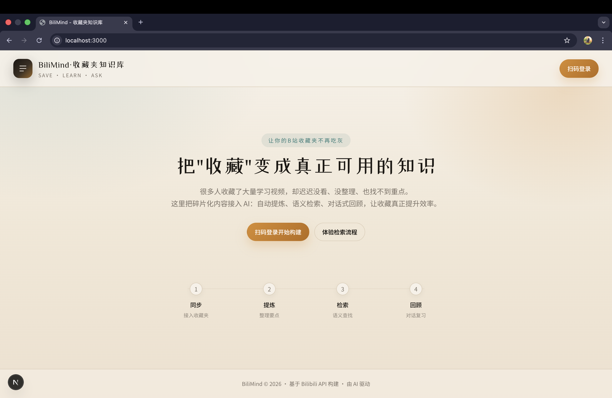
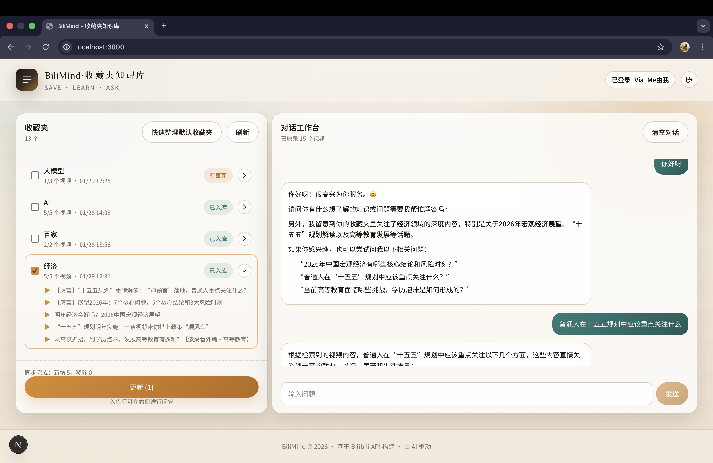

# 🚀 Bilibili RAG：把收藏夹变成可对话的知识库

把你在 B 站收藏的访谈/演讲/课程，变成可检索、可追溯来源的**个人知识库**。  
适合：访谈/演讲/课程、技术视频与学习视频整理、公开课复盘、知识总结、会议/分享回顾、播客内容归档等。

> 亮点：自动拉取内容 → 语音转写 → 向量检索 → 对话问答

---

## ✨ 功能一览

- ✅ B 站扫码登录，读取收藏夹
- ✅ 音频转文字（ASR），自动兜底处理
- ✅ 语义检索（向量检索）
- ✅ 基于 RAG 的对话问答
- ✅ 本地 SQLite + ChromaDB 存储

---

## 🖼️ 演示与截图（请自行补充）

**建议目录结构**

- `assets/screenshots/`：截图  
- `assets/demo/`：演示视频或 GIF  

**示例占位**




演示视频：
- `assets/demo/demo.mp4`  
- 或外链（B 站/YouTube）替换下面链接  
[演示视频](assets/demo/demo.mp4)

---

## ⚡ 快速开始（3 步）

0) 安装 ffmpeg（并确保在 PATH 中）  
- macOS: `brew install ffmpeg`  
- Windows: 下载安装包后将 `bin` 目录加入 PATH  
- Linux: `apt/yum/pacman` 安装 `ffmpeg`  

1) 安装依赖  
```bash
conda activate bilibili-rag
pip install -r requirements.txt
```

2) 配置环境变量  
```bash
cp .env.example .env
# 编辑 .env，填写 DashScope API Key 等配置
```

3) 启动服务  
```bash
python -m uvicorn app.main:app --reload
```
后端文档：`http://localhost:8000/docs`

前端：
```bash
cd frontend
npm install
npm run dev
```
前端页面：`http://localhost:3000`

---

## 🧠 工作流程

1. 选择收藏夹  
2. 拉取视频 → 音频转写（ASR）  
3. 生成向量 → 构建知识库  
4. 对话/检索问答  

---

## 🧪 测试与诊断脚本

> 注意：`test/` 目录下的脚本需要 **移动到项目根目录** 再运行（依赖相对路径与配置）。

- `debug_asr_single.py`：测试单个视频是否能正确获取音频  
- `diagnose_rag.py`：测试向量检索召回是否准确  
- `sync_cache_vectors.py`：同步数据库缓存数据到向量库  

---

## 🎧 ASR 说明（音频不可达兜底）

部分 B 站音频 URL 可能返回 403（直链不可拉取），系统会自动执行兜底流程：

1. 本地下载音频（带 Cookie）
2. ffmpeg 转码为 16k 单声道
3. 上传到 DashScope 后再识别

> 请确保本机已安装 `ffmpeg` 并加入 PATH。

---

## 💰 费用说明（DashScope）

模型相关费用包括：
- LLM 对话（按 Token）
- Embedding（按 Token）
- ASR 音频转写（按时长）

建议：
- 部署/测试阶段先用 **短视频（约 10 分钟）**验证流程与费用  
- 正式使用按需启用，注意费用；大多数模型有免费额度，通常足够日常使用  

---

## 🧩 技术栈

- 后端：FastAPI  
- LLM：LangChain + DashScope  
- 向量库：ChromaDB  
- 前端：Next.js + Tailwind  
- 数据库：SQLite  

---

## 📂 目录结构（简版）

```
bilibili-rag/
├── app/                # 后端逻辑
├── frontend/           # 前端界面
├── data/               # 数据库与向量库
├── test/               # 测试脚本（需移动到根目录再运行）
└── README.md
```

---

## ✅ 常见问题

**Q：为什么有些音频 URL 可达、有些不可达？**  
A：B 站音频直链存在鉴权/过期/区域限制，只有公网可直接拉取的 URL 才可达。

---

## 📜 License

MIT
