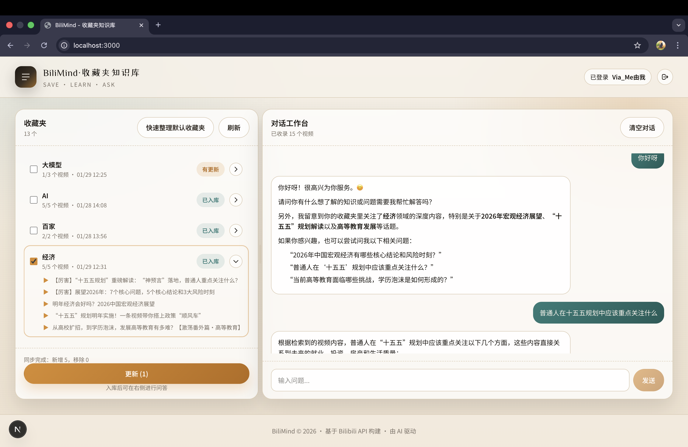

# 🚀 Bilibili RAG：把收藏夹变成可对话的知识库

把你在 B 站收藏的访谈/演讲/课程，变成可检索、可追溯来源的**个人知识库**。
适合：访谈/演讲/课程、技术视频与学习视频整理、公开课复盘、知识总结、会议/分享回顾、播客内容归档等。

> 亮点：自动拉取内容 → 语音转写 → 向量检索 → 对话问答

---

## ✨ 功能一览

- ✅ B 站扫码登录，读取收藏夹
- ✅ 支持**分 P 视频**的逐 P 处理与向量化
- ✅ 音频转文字（ASR），自动兜底处理
- ✅ 语义检索（向量检索）+ **Agentic RAG** 智能问答
- ✅ 多路由策略（direct / db_list / db_content / vector）自动选择
- ✅ 本地 SQLite + ChromaDB 存储
- ✅ **LangSmith** 自动追踪集成，可观测 LLM 调用链路
- ✅ OpenClaw Skill 本地接入

---

## 🖼️ 演示与截图




## B站演示视频：
[演示视频](https://b23.tv/bGXyhjU)

## ⭐ Star History
[](https://star-history.com/#via007/bilibili-rag&Date)

---

## 🏗️ 系统架构

```
┌─────────────────────────────────────────────────────────────────────────┐
│                              前端 (Next.js 15)                           │
│  ┌──────────────┐  ┌──────────────┐  ┌──────────────┐  ┌─────────────┐ │
│  │ SourcesPanel │  │  ChatPanel   │  │  LoginModal  │  │ASRViewer... │ │
│  │ 收藏夹/来源   │  │  对话面板     │  │  扫码登录     │  │ 转写查看    │ │
│  └──────┬───────┘  └──────┬───────┘  └──────────────┘  └─────────────┘ │
│         └─────────────────┘                                             │
│                    │                                                    │
│         ┌──────────┴──────────┐                                       │
│         │    lib/api.ts       │  ← 唯一 API 调用入口                   │
│         └──────────┬──────────┘                                       │
└────────────────────┼────────────────────────────────────────────────────┘
                     │ HTTP / SSE
┌────────────────────┼────────────────────────────────────────────────────┐
│                    ▼                                                    │
│  ┌─────────────────────────────────────────────────────────────────┐   │
│  │                    FastAPI 后端 (Python)                         │   │
│  │  ┌──────────┐ ┌──────────┐ ┌──────────┐ ┌──────────┐          │   │
│  │  │ /auth    │ │/favorites│ │ /chat    │ │/knowledge│          │   │
│  │  │ 认证     │ │ 收藏夹   │ │ 对话     │ │ 知识库   │          │   │
│  │  └────┬─────┘ └────┬─────┘ └────┬─────┘ └────┬─────┘          │   │
│  │  ┌────┴────────────┴────────────┴────────────┴────┐            │   │
│  │  │              Services 业务层                    │            │   │
│  │  │  ┌────────┐ ┌────────┐ ┌────────┐ ┌────────┐  │            │   │
│  │  │  │bilibili│ │content_│ │  asr   │ │  rag   │  │            │   │
│  │  │  │  B站API │ │fetcher │ │ 语音转写│ │向量/RAG│  │            │   │
│  │  │  └────────┘ └────────┘ └────────┘ └────────┘  │            │   │
│  │  └───────────────────────────────────────────────┘            │   │
│  │  ┌──────────────────┐    ┌──────────────────┐                 │   │
│  │  │   SQLite         │    │   ChromaDB       │                 │   │
│  │  │  (结构化数据)     │    │  (向量存储)       │                 │   │
│  │  └──────────────────┘    └──────────────────┘                 │   │
│  └─────────────────────────────────────────────────────────────────┘   │
└─────────────────────────────────────────────────────────────────────────┘
```

### 核心链路

```
B站数据获取 → 内容提取（ASR/字幕/摘要） → 文本分块 → Embedding → ChromaDB
                                                              ↓
用户提问 ← LLM 生成回答 ← 向量检索 + 重排序 ← Query Embedding
```

---

## ⚡ 快速开始

### 0) 前置依赖

| 工具 | 版本要求 | 说明 |
|------|---------|------|
| Python | >= 3.10 | 后端运行环境 |
| Node.js | >= 18 | 前端运行环境 |
| ffmpeg | 最新版 | ASR 音频处理依赖 |
| Conda (推荐) | - | Python 环境管理 |

安装 ffmpeg：
- macOS: `brew install ffmpeg`
- Windows: 下载安装包后将 `bin` 目录加入 PATH
- Linux: `apt/yum/pacman` 安装 `ffmpeg`

### 1) 安装后端依赖

```bash
conda create -n bilibili-rag python=3.10
conda activate bilibili-rag
pip install -r requirements.txt
```

### 2) 配置环境变量

```bash
cp .env.example .env
# 编辑 .env，填入 DashScope API Key 等配置
```

**关键配置项：**

| 变量 | 说明 | 必填 |
|------|------|------|
| `DASHSCOPE_API_KEY` | 阿里云 DashScope API Key | ✅ |
| `LLM_MODEL` | LLM 模型名称，默认 `qwen3-max` | ✅ |
| `EMBEDDING_MODEL` | Embedding 模型，默认 `text-embedding-v4` | ✅ |
| `DATABASE_URL` | SQLite 数据库路径 | - |
| `CHROMA_PERSIST_DIRECTORY` | ChromaDB 持久化目录 | - |

完整配置说明见 [.env.example](.env.example)。

### 3) 启动后端

```bash
# 方式一：直接启动
python -m uvicorn app.main:app --reload

# 方式二：使用脚本（后台运行）
# Linux/macOS:
./scripts/start.sh
# Windows PowerShell:
./scripts/start.ps1
```

后端文档：`http://localhost:8000/docs`

### 4) 启动前端

```bash
cd frontend
npm install
npm run dev
```

前端页面：`http://localhost:3000`

### 5) 停止服务

```bash
# Linux/macOS:
./scripts/stop.sh
# Windows PowerShell:
./scripts/stop.ps1
```

---

## 📂 目录结构

```
bilibili-rag/
├── app/                        # 后端应用根目录
│   ├── config.py               # 配置管理（读取 .env）
│   ├── database.py             # SQLite 异步连接 & 初始化
│   ├── main.py                 # FastAPI 应用入口
│   ├── models.py               # Pydantic/SQLAlchemy 数据模型
│   ├── routers/                # HTTP 路由层
│   │   ├── auth.py             # B站扫码登录
│   │   ├── chat.py             # 智能问答（Orchestrator）
│   │   ├── favorites.py        # 收藏夹管理
│   │   ├── knowledge.py        # 知识库同步/构建
│   │   ├── asr.py              # 分P视频 ASR 转写
│   │   └── vector_page.py      # 分P视频向量化
│   └── services/               # 业务逻辑层
│       ├── bilibili.py         # B站 API 调用
│       ├── content_fetcher.py  # 内容获取（音频/字幕）
│       ├── asr.py              # 语音转文本服务
│       ├── rag.py              # 向量检索/RAG 核心
│       ├── wbi.py              # WBI 反爬签名
│       └── query.py            # 查询重写/Agentic RAG
│
├── frontend/                   # Next.js 前端
│   ├── app/                    # App Router 页面
│   │   ├── layout.tsx          # 根布局
│   │   ├── page.tsx            # 首页
│   │   └── globals.css         # 全局样式
│   ├── components/             # React 组件
│   │   ├── ChatPanel.tsx       # 聊天面板
│   │   ├── SourcesPanel.tsx    # 收藏夹/来源面板
│   │   ├── LoginModal.tsx      # 扫码登录弹窗
│   │   ├── ASRViewerModal.tsx  # ASR 结果查看
│   │   ├── WorkspacePanel.tsx  # 工作区面板
│   │   └── ui/                 # shadcn/ui 组件库
│   └── lib/
│       └── api.ts              # 唯一 API 调用入口
│
├── api/                        # API 文档
│   ├── README.md               # API 文档说明
│   └── openapi.yaml            # OpenAPI 3.0 规范
│
├── architecture/               # 架构文档
│   └── app/                    # 各模块详细文档
│
├── skills/                     # OpenClaw Skills
│   └── bilibili-rag-local/     # 本地接入 Skill
│
├── data/                       # 数据目录（不提交）
│   ├── bilibili_rag.db         # SQLite 数据库
│   └── chroma_db/              # ChromaDB 向量库
│
├── scripts/                    # 启动/停止脚本
│   ├── start.sh / start.ps1
│   └── stop.sh / stop.ps1
│
├── logs/                       # 日志目录
├── .env.example                # 环境变量模板
├── requirements.txt            # Python 依赖
└── README.md                   # 本文档
```

---

## 🧠 工作流程

```
1. 扫码登录 → 获取收藏夹列表
2. 选择收藏夹 → 点击「入库/更新」
3. 系统执行：拉取视频 → 音频转写（ASR）→ 生成向量 → 写入 ChromaDB
4. 在 ChatPanel 中提问，系统自动选择最佳路由策略回答
```

### 分P视频支持

对于多 P 视频（合集/课程），系统支持：
- 逐 P 展示列表
- 单 P 独立的 ASR 转写
- 单 P 独立的向量化入库
- 工作区勾选，精确选择要检索的分 P 范围

### 路由策略

对话接口采用智能路由，自动选择最佳回答策略：

| 路由 | 说明 | 使用场景 |
|------|------|----------|
| `direct` | 直接回答 | 寒暄、闲聊、通用问题 |
| `db_list` | 列表回答 | "有哪些"、"清单"、"目录"类问题 |
| `db_content` | 内容总结 | "总结"、"概述"、"分析"类问题 |
| `vector` | 向量检索+RAG | 具体主题问题，需要检索相关内容 |

---

## 🔌 API 文档

系统提供完整的 RESTful API，交互式文档在启动后自动可用：

- **Swagger UI**: `http://localhost:8000/docs`
- **ReDoc**: `http://localhost:8000/redoc`
- **OpenAPI YAML**: 见 [`api/openapi.yaml`](api/openapi.yaml)
- **API 文档说明**: 见 [`api/README.md`](api/README.md)

### 主要接口分组

| 分组 | 路径前缀 | 说明 |
|------|----------|------|
| 认证 | `/auth` | 扫码登录、会话管理 |
| 收藏夹 | `/favorites` | 收藏夹列表、视频、整理 |
| 对话 | `/chat` | 智能问答、流式问答、搜索 |
| 知识库 | `/knowledge` | 同步、构建、状态、清空 |
| ASR | `/asr` | 分P视频语音转写 |
| 分P向量 | `/vec/page` | 分P视频向量化任务 |

---

## 🤖 OpenClaw Skill（本地接入）

本仓库已提供一个可直接使用的 Skill：`skills/bilibili-rag-local/SKILL.md`。
作用：把本地运行的 `bilibili-rag` 服务接入 OpenClaw，让 OpenClaw 直接调用你的收藏夹知识库进行检索和问答。

### 前置条件

1. 先按上面的步骤完成本项目本地部署。
2. 确认后端接口可访问：`http://127.0.0.1:8000/docs`。
3. 确认 OpenClaw 已安装并可加载本地 Skills。

### 接入方式

1. 将本仓库中的 `skills/bilibili-rag-local` 放到 OpenClaw 的 Skills 目录（例如 `~/.openclaw/skills/`）。
2. 重启或刷新 OpenClaw Skills。
3. 在 OpenClaw 中调用该 Skill，让它通过本地 API 执行：
   - `POST /chat/ask`（问答）
   - `POST /chat/search`（检索片段）
   - `GET /knowledge/folders/status`（入库状态）

### 使用建议

1. 先同步/入库收藏夹，再进行问答。
2. 问题越具体，召回效果越好。
3. 若出现"无命中"，优先检查是否完成入库或是否选错收藏夹。

---

## 🧩 基于 Skill 的扩展示例

你可以在 `skills/` 目录继续开发更多 Skill，把收藏夹真正变成可持续运营的知识系统。
例如结合 OpenClaw 的定时能力（Cron）做自动化：

1. 每日/每周统计收藏夹入库状态（新增、未入库、失败项）。
2. 定时生成"新增收藏学习摘要"（按主题聚合要点）。
3. 定时输出"待补全内容清单"（ASR 失败、内容过短、召回弱视频）。
4. 将统计结果自动推送到你常用的消息渠道，形成固定复盘节奏。

---

## 🧪 测试与诊断

```bash
# 向量检索链路自检（P0，每次提交前必须运行）
python test/diagnose_rag.py

# 聊天接口测试（修改 chat/rag 后运行）
python test/test_chat.py

# 同步链路测试（修改 knowledge/asr 后运行）
python test/test_sync.py
```

---

## 🎧 ASR 说明（音频不可达兜底）

部分 B 站音频 URL 可能返回 403（直链不可拉取），系统会自动执行兜底流程：

1. 本地下载音频（带 Cookie）
2. ffmpeg 转码为 16k 单声道
3. 上传到 DashScope 后再识别

> 请确保本机已安装 `ffmpeg` 并加入 PATH。

---

## 💰 费用说明（DashScope）

模型相关费用包括：
- LLM 对话（按 Token）
- Embedding（按 Token）
- ASR 音频转写（按时长）

建议：
- 部署/测试阶段先用 **短视频（约 10 分钟）**验证流程与费用
- 正式使用按需启用，注意费用；大多数模型有免费额度，通常足够日常使用

---

## 🧩 技术栈

### 后端
- **Web 框架**: FastAPI + Uvicorn
- **LLM 调用**: LangChain + OpenAI SDK (DashScope 兼容模式)
- **向量库**: ChromaDB
- **数据库**: SQLite + SQLAlchemy (异步)
- **语音转写**: DashScope ASR (Paraformer)
- **可观测性**: LangSmith 自动追踪

### 前端
- **框架**: Next.js 15 (App Router)
- **语言**: TypeScript
- **样式**: Tailwind CSS
- **组件库**: shadcn/ui (base-nova 风格)
- **状态**: React Hooks
- **图标**: Lucide React

---

## 📂 数据存储

| 数据 | 存储位置 | 说明 |
|------|---------|------|
| 收藏夹列表 | SQLite | 结构化数据 |
| 视频内容 | SQLite | ASR 文本、简介等 |
| 向量数据 | ChromaDB | Embedding 向量 + chunk |
| 用户会话 | SQLite + 内存 | session 持久化 |

---

## ✅ 常见问题

**Q：为什么有些音频 URL 可达、有些不可达？**
A：B 站音频直链存在鉴权/过期/区域限制，只有公网可直接拉取的 URL 才可达。

**Q：分 P 视频如何入库？**
A：在 SourcesPanel 中展开分 P 列表，可以对单 P 执行「转文字」和「向量化」。也支持整批处理。

**Q：对话返回"未检索到相关内容"怎么办？**
A：检查 1) 是否已完成收藏夹入库；2) 是否选中了正确的收藏夹；3) 问题是否与视频内容相关。

**Q：如何查看 LLM 调用链路？**
A：配置 `LANGSMITH_API_KEY` 后，访问 LangSmith 控制台即可查看每次问答的完整 trace。

**Q：支持哪些 LLM 模型？**
A：任何兼容 OpenAI API 格式的模型均可，如 DashScope、OpenAI、Anthropic (通过代理) 等。

---

> 免责声明：本项目仅供个人学习与技术研究，使用者需自行遵守相关平台协议与法律法规，禁止用于未授权的商业或违规用途。

---

## 📜 License

MIT

---

## 🧩 TodoList

- [x] 分 P 视频支持与逐 P 向量化
- [x] Agentic RAG 智能问答模式
- [x] LangSmith 可观测性集成
- [ ] 对话存储、会话管理、检索历史对话记录
- [ ] 适配更多 LLM 与向量模型
- [ ] 增量同步（只处理新增/变更视频）
