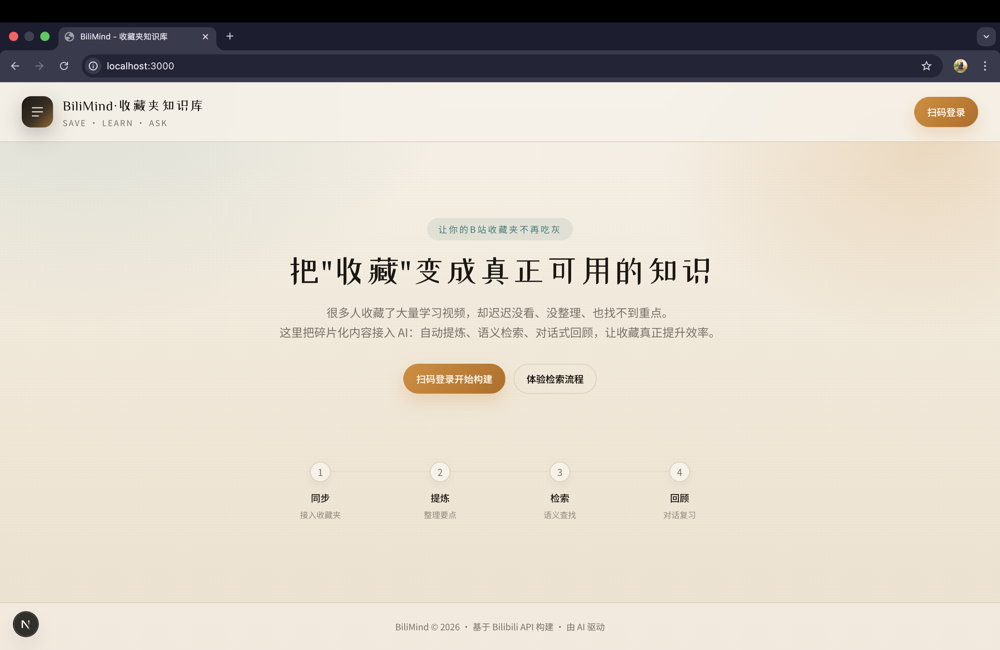
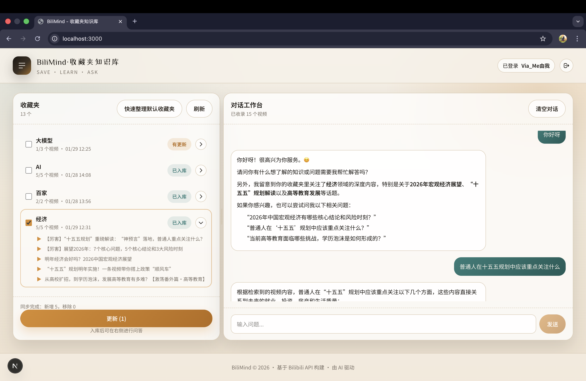

# Bilibili RAG: Turn Bilibili Favorites into a Chat-Ready Knowledge Base

English | [Chinese](README.md)

Bilibili RAG turns your Bilibili favorite folders into a searchable, source-traceable personal knowledge base. It syncs videos from your favorites, transcribes audio, builds a local vector index, supports RAG-based chat, and exports raw transcripts or AI-organized notes as Markdown.

It is useful for interviews, talks, courses, public lectures, technical videos, podcast-style videos, meeting recordings, and any long-form video collection you want to review or reuse.

> Core flow: Bilibili favorites -> ASR transcript -> vector search -> RAG chat -> Markdown notes

---

## Features

- QR-code login for Bilibili and favorite-folder syncing
- Audio-to-text transcription with DashScope ASR
- Multi-part Bilibili video ingestion, processed part by part
- Semantic retrieval with vector search
- RAG chat with source-traceable answers
- Markdown export for raw transcripts and AI-organized notes
- Local SQLite + ChromaDB storage
- Docker Compose setup for running the frontend and backend together
- OpenClaw Skill for querying a local Bilibili RAG service from an agent workflow

---

## Screenshots and Demo




Bilibili demo video: [https://b23.tv/bGXyhjU](https://b23.tv/bGXyhjU)

## Star History

[](https://star-history.dera.page/#via007/bilibili-rag&Date)

---

## Quick Start

### Prerequisites

- Python environment, such as Conda
- Node.js and npm for the frontend
- `ffmpeg` available in `PATH`
- A DashScope / Bailian API key for ASR, embedding, and chat

Install `ffmpeg`:

```bash
# macOS
brew install ffmpeg

# Linux
sudo apt install ffmpeg
```

For Windows, install an `ffmpeg` build and add its `bin` directory to `PATH`.

### 1. Install backend dependencies

```bash
conda activate bilibili-rag
pip install -r requirements.txt
```

### 2. Configure environment variables

```bash
cp .env.example .env
```

Edit `.env` and set at least your DashScope API key:

```env
DASHSCOPE_API_KEY=your-dashscope-api-key
OPENAI_API_KEY=
OPENAI_BASE_URL=https://dashscope.aliyuncs.com/compatible-mode/v1
LLM_MODEL=qwen3-max
EMBEDDING_MODEL=text-embedding-v4
CHAT_USE_LLM_ROUTER=false
```

Optional retrieval tuning:

```env
RETRIEVAL_CANDIDATE_K=24
RETRIEVAL_TOP_K=8
RETRIEVAL_MMR_FETCH_K=32
RETRIEVAL_MMR_LAMBDA=0.55
```

Notes:

- `.env` must be placed in the project root, not under `frontend/`.
- `OPENAI_BASE_URL` is used for LLM chat. For DashScope OpenAI-compatible mode, use `https://dashscope.aliyuncs.com/compatible-mode/v1`.
- `DASHSCOPE_API_KEY` is used by DashScope ASR and embedding. Embedding is called through the DashScope SDK and does not use `OPENAI_BASE_URL`.
- `DASHSCOPE_BASE_URL` is used only for ASR. Do not use it as the LLM chat endpoint.
- `CHAT_USE_LLM_ROUTER=false` skips an extra router-model call before each answer and improves first-token latency.
- Restart the backend after changing `.env`.
- Never commit real API keys.

### 3. Start the backend

```bash
python -m uvicorn app.main:app --reload
```

Backend API docs: `http://localhost:8000/docs`

### 4. Start the frontend

```bash
cd frontend
npm install
npm run dev
```

Frontend: `http://localhost:3000`

---

## Docker Compose

For a quick local setup, Docker Compose starts both the backend and frontend. Data is persisted under `data/`, and logs are written under `logs/`.

```bash
cp .env.example .env
# Edit .env and set at least DASHSCOPE_API_KEY or OPENAI_API_KEY
docker compose up --build
```

Open:

- Frontend: `http://localhost:3000`
- Backend docs: `http://localhost:8000/docs`

Stop services:

```bash
docker compose down
```

After changing models or API keys in `.env`, rebuild and restart:

```bash
docker compose up --build
```

---

## How It Works

1. Log in to Bilibili with QR-code authentication.
2. Select a favorite folder.
3. Fetch video metadata and audio/transcript content.
4. Run ASR when transcript content is unavailable.
5. Split content into chunks and create embeddings.
6. Store metadata in SQLite and vectors in ChromaDB.
7. Ask questions, inspect retrieved sources, or export Markdown notes.

For multi-part videos, each part is transcribed separately and then merged into one indexed document. The merged content keeps part headings such as `## P1 ...` and `## P2 ...`, so answers and exports remain easier to trace.

---

## Markdown Export

The app can export:

- Raw video transcripts
- AI-organized Markdown notes

If a single video has not been ingested yet, the export flow can ingest that video before generating the Markdown output.

---

## OpenClaw Skill

This repository includes a local Skill at:

```text
skills/bilibili-rag-local/SKILL.md
```

It lets OpenClaw query a locally running Bilibili RAG service through the backend API:

- `POST /chat/ask`
- `POST /chat/search`
- `GET /knowledge/folders/status`

Recommended workflow:

1. Run the backend locally.
2. Sync and ingest the target favorite folders.
3. Copy `skills/bilibili-rag-local` into your OpenClaw Skills directory.
4. Ask questions against specific indexed folders.

---

## ASR Notes

Some Bilibili audio URLs may return `403` because of authentication, expiration, or regional restrictions. When direct audio access fails, the system falls back to:

1. Downloading audio locally with cookies
2. Converting it to 16 kHz mono audio with `ffmpeg`
3. Uploading the converted audio to DashScope for ASR

Make sure `ffmpeg` is installed and available in `PATH`.

Multi-part videos increase ASR time and cost based on the total duration of all parts.

---

## Cost Notes

Model costs may include:

- LLM chat tokens
- Embedding tokens
- ASR audio duration

For first-time setup, test with a short video of around 10 minutes before ingesting a large folder.

---

## Troubleshooting

### `The api_key client option must be set`

The backend did not load a valid API key. Check that `.env` is in the project root and that `DASHSCOPE_API_KEY` or `OPENAI_API_KEY` is set.

### What should `OPENAI_BASE_URL` be for DashScope?

Use:

```env
OPENAI_BASE_URL=https://dashscope.aliyuncs.com/compatible-mode/v1
```

Do not use `https://coding.dashscope.aliyuncs.com/v1`, and do not put the ASR `DASHSCOPE_BASE_URL` here.

### `DashScope Embedding initialization failed`

Install backend dependencies again and restart the backend:

```bash
pip install -r requirements.txt
```

Embedding uses the DashScope SDK and does not automatically switch to `OPENAI_BASE_URL`.

### `AllocationQuota.FreeTierOnly`

This is an upstream model-service quota error. It usually means the free quota is exhausted or the provider account is configured to use only free quota. Adjust quota or billing settings in the model provider console, or switch to an available model.

### I changed `.env`, but the model did not change

Configuration is loaded when the backend starts. Restart the `uvicorn` backend service after changing `.env`.

### Search returns no results

Check whether the target favorite folder has been synced and ingested. Also make sure you are asking against the intended folder scope.

---

## Tests

Common local checks:

```bash
conda run -n bilibili-rag python -m unittest discover -s test -p 'test_*.py'
conda run -n bilibili-rag python -m compileall app test
git diff --check
```

---

## Tech Stack

- Backend: FastAPI
- Frontend: Next.js + Tailwind CSS
- LLM orchestration: LangChain
- Model provider: DashScope / OpenAI-compatible chat endpoint
- Vector store: ChromaDB
- Database: SQLite
- ASR: DashScope Paraformer

---

## Project Structure

```text
bilibili-rag/
|-- app/                # Backend API, services, retrieval, ASR
|-- frontend/           # Next.js frontend
|-- data/               # Local database and vector store
|-- assets/             # Screenshots and demo assets
|-- skills/             # OpenClaw Skills
|-- test/               # Unit tests and diagnostic scripts
|-- README.md           # Chinese README
`-- README_EN.md        # English README
```

---

## License

This project is released under the [Apache License 2.0](LICENSE).

## Disclaimer

Users are responsible for complying with platform terms, copyright rules, and applicable laws. This project does not grant any rights to Bilibili videos, audio, subtitles, or other third-party content.
